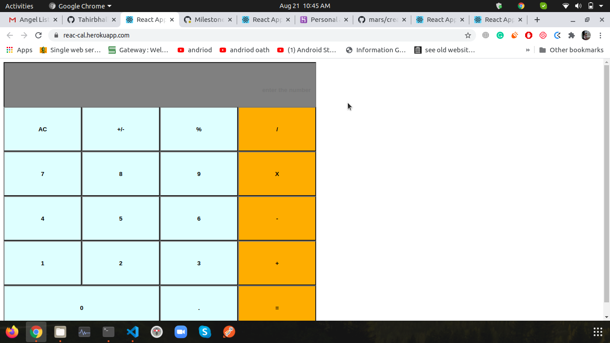

## React Calculator

This is a Simple calculator that is build with reactjs, you can perform operations like addition subtraction etc, Main focused is on UI.

## Built With

- Html,
- CSS
- javascript
- React

## Live Link
- [Live Link](https://reac-cal.herokuapp.com/)

👤 **Author**

- Github: [Tahir Ahmad](https://github.com/tahirbhalli/)

## 🤝 Contributing

Contributions, issues and feature requests are welcome! Start by:
* Forking the project
* Cloning the project to your local machine
* `cd` into the Youtube-Replica project directory
* Run `git checkout -b your-branch-name`
* Make your contributions
* Push your branch up to your forked repository
* Open a Pull Request with a detailed description to the development branch of the original project for a review

## 📝 License

This project is [MIT](https://opensource.org/licenses/MIT) licensed.